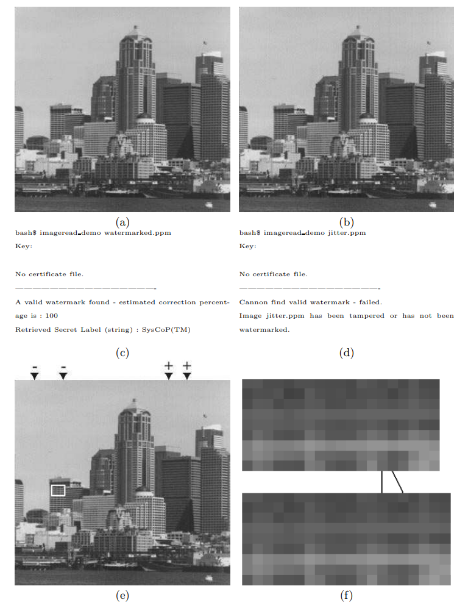
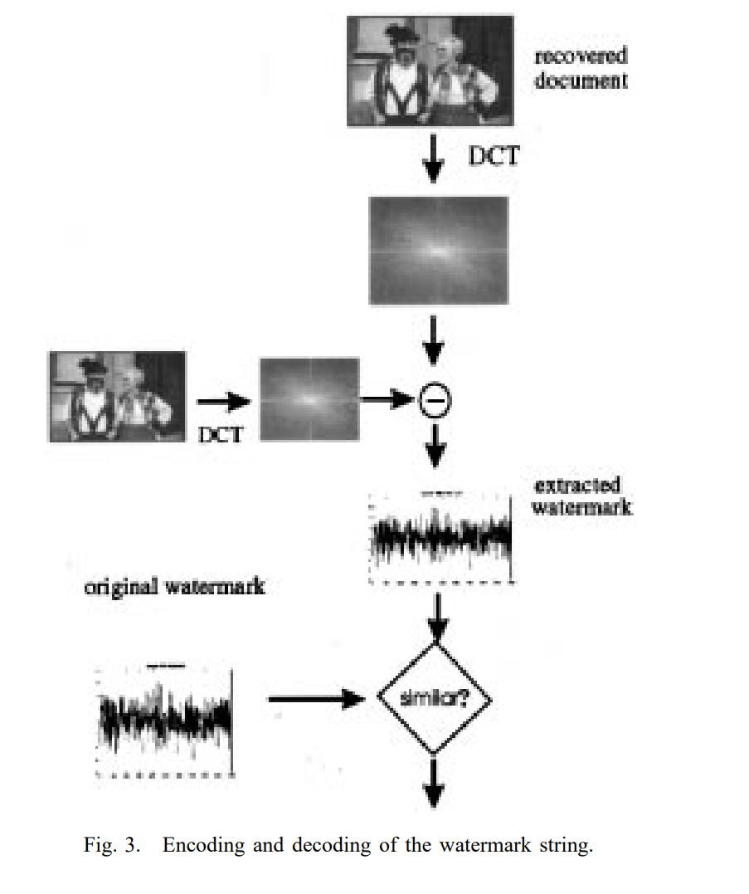

# 图片隐藏水印消除与鲁棒检测

## 一、题目简介

图片隐藏水印技术通过在图像的空间域、频率域或神经网络特征域中嵌入不可见或低可见性的信号，用于内容溯源、版权保护、生成内容标识与平台治理；然而带水印图片在真实传播中会经历 JPEG 重编码、缩放、模糊、降噪等各类后处理，这些操作可能在不明显损害视觉质量的前提下削弱甚至消除隐藏水印，使检测器无法可靠区分带水印图片与不带水印图片。本题围绕统一的图片水印服务构建"水印消除—鲁棒嵌入与检测"攻防对抗场景：攻击方对带水印图片设计自动化、查询无关的水印消除算法，在限制修改幅度、保持图像语义与视觉质量的前提下，尽量降低水印检测器区分带水印与不带水印图片的能力；防御方则同时提交水印嵌入算法与水印检测算法，嵌入算法需生成视觉不可感知的隐藏水印，检测算法仅根据输入图片输出其包含本方水印的概率，并在多种未知攻击后仍保持较高的检测能力。评测系统通过同源配对与对称攻击将攻击算法与防御算法组合成完整攻防矩阵，以 ROC-AUC 作为双方的对抗指标，考查对数字水印鲁棒性、图像后处理与统计检测的综合理解与实现能力。

## 二、算法原理

### 2.1 攻击方原理

攻击方的总体目标是：对给定的带隐藏水印图片 $I_i^w=E_d(I_i)$，生成攻击后图片 $\widetilde{I}_i^w=A_a(I_i^w)$，在满足图像合法性、视觉质量与语义一致性约束的前提下，使防御检测器对"攻击后带水印图片"与"攻击后无水印对照图片"的 ROC-AUC 尽可能低。攻击方只获得输入图片（字段中不含正负标签），接口为单样本函数：

```python
def attack(sample: dict) -> dict:
    """sample["sample_id"]: str; sample["image"]: RGB uint8 H×W×3
    返回 {"image": RGB uint8 H×W×3}"""
```

常见攻击思路可分为三大类：**有损重编码**，如 JPEG/WebP 压缩，通过量化与色度降采样破坏水印所在的中高频系数；**几何变换**，如缩放、裁剪、轻微旋转，通过重采样打乱像素与分块的对齐关系；**滤波去噪**，如高斯模糊、中值滤波、双边滤波，直接平滑掉叠加在水印载体上的微弱信号。攻击方不得查询检测器或依据检测分数迭代优化，不得访问防御代码、权重与密钥，不得输出空图、纯色图、大面积遮挡或语义不同的图片（赛题 §8.3 黑盒约束）。

**A0 组合后处理攻击**。该算法把三类最典型的传播后处理按固定顺序组合成一次确定性变换：

$$
A_0(I) = \text{GaussianBlur}_{\sigma=0.4}\left( \text{Resize}_{w,h}\left( \text{Resize}_{0.9w,0.9h}\left( \text{JPEG}_{q=75}(I) \right) \right) \right)
$$

实现步骤为：① JPEG 压缩重编码，质量参数 $q=75$，通过 Pillow 在内存中编码解码完成（BytesIO，不读写文件）；② 双线性缩放至原尺寸的 $90\%$；③ 双线性还原回原尺寸（重采样过程破坏像素与 8×8 DCT 分块的对应关系）；④ 轻度高斯模糊，$\sigma=0.4$（仅对空间坐标轴滤波，通道独立）。全部参数固定、不含随机性，对每个样本返回确定的输出；接口为 `attack(sample) -> {"image"}`，输入输出均为 RGB uint8 H×W×3，尺寸通道不变。算法对每张 $H\times W$ 图像执行常数次 JPEG 编码解码、两次双线性重采样与一次可分离卷积，时间复杂度 $O(HW)$，空间复杂度 $O(HW)$，完全在 CPU 上秒级完成。该攻击的消除原理在于：JPEG 量化会截断水印所在中频 DCT 系数的细微幅值，缩放重采样会把水印能量扩散到相邻块，而低通高斯模糊进一步抑制高频成分，三者叠加使扩频水印的相关性统计量显著衰减。若环境未安装 Pillow，JPEG 步骤自动降级跳过（仅剩"缩放+模糊"），流水线不中断、攻击效果略减弱。评测中另以恒等攻击（Identity，原样返回输入）作为"不攻击"对照，用于计算 Clean AUC 与资格判定基线 $M_{Id,d}$。在该基线之上，更强的攻击通常表现为更低的 JPEG 质量（如 $q=60$）、更大的模糊半径（如 $\sigma=0.8$）或在缩放间隙加入轻微随机噪声，但会面临更严格的质量门槛（§3.2）约束。

<figure style="margin:10pt auto; text-align:center;">

<figcaption style="font-size:10pt; text-align:center; margin-top:4pt;">A0 组合后处理攻击算法示意图</figcaption>
</figure>

### 2.2 防守方原理

防守方的总体目标是：提交一对算法——水印嵌入算法 $E_d$ 与水印检测算法 $D_d$，检测算法对任意输入图片输出连续分数 $s=D_d(I)\in[0,1]$（越接近 1 越可能包含本方水印），并同时满足水印不可见、无攻击时可可靠检测、未知攻击后仍保持较高检测能力、不带水印图片误报低、资源消耗受限等要求。本题为零比特水印任务，只需判断"是否包含本方水印"，不要求恢复字符串或多比特消息；防御方可在内部使用固定密钥、伪随机序列或模型参数作为秘密信息，密钥仅在防御容器内可见，攻击容器无法访问。技术路线可分为三大类：**空间域水印**，直接在像素亮度或色度上叠加低幅调制信号，实现简单但对有损压缩脆弱；**频率域水印**，在 DCT/DWT 等变换域系数上嵌入扩频信号，与 JPEG/缩放等后处理天然对抗，是工业界最常用的路线；**神经网络水印**，用编码器-解码器网络学习内容自适应嵌入，配合 CNN 检测器，鲁棒性强但需要训练数据与算力。

**D0 DCT 中频扩频零比特水印**。其核心思想是把一段与内容无关的伪随机扩频码（PN 序列）按图像局部能量自适应地叠加到亮度通道 8×8 块的若干中频 DCT 系数上，检测时通过统计相关性判断该 PN 码是否存在。嵌入流程为：① 颜色空间转换，把 RGB 图像转为 YCbCr，仅亮度通道 Y 参与嵌入：

$$
Y = 0.299R + 0.587G + 0.114B, \qquad
C_b = -0.168736R - 0.331264G + 0.5B + 128, \qquad
C_r = 0.5R - 0.418688G - 0.081312B + 128
$$

② 把亮度通道划分为 $8\times 8$ 块，对每块做正交归一化的 II 型二维 DCT（`scipy.fft.dctn`，`norm="ortho"`）；③ 按固定公开密钥（随机种子 $SEED=20240607$）生成 $K=8$ 长的 $\{-1,+1\}$ 伪随机序列 $\boldsymbol{p}=(p_1,\dots,p_K)$，并固定选中 $8$ 个中频系数位置 $\{(1,2),(2,1),(2,2),(1,3),(3,1),(2,3),(3,2),(3,3)\}$（避开 DC 与极低频/极高频，抗 JPEG 量化）；④ 计算每块的局部能量 $\text{energy}=\sqrt{\sum \text{AC}^2}$（去掉 DC 系数后的 AC 能量），得到自适应强度 $\text{scale}=\operatorname{clip}(\text{energy}/\overline{\text{energy}},\ 0.2,\ 2.5)$，其中 $\overline{\text{energy}}$ 为全图 AC 能量均值；⑤ 对选中系数做加性嵌入：

$$
\hat{c}_{b,k} = c_{b,k} + \alpha \cdot p_k \cdot \text{scale}_b, \qquad \alpha = 2.0
$$

⑥ 逆 DCT 恢复亮度通道，重建 RGB 并截断到 $[0,255]$ 输出 uint8 图像。检测流程为：对输入图像同样做颜色转换与分块 DCT，取出每块选中系数向量 $\boldsymbol{s}_b$，计算逐块归一化相关性（对块能量归一，避免高纹理块的自然能量淹没水印信号）：

$$
c_b = \frac{\langle \boldsymbol{s}_b, \boldsymbol{p}\rangle}{\|\boldsymbol{s}_b\| \cdot \sqrt{K}}
$$

随后聚合为 $z$ 统计量并映射为概率（零假设下 $z$ 近似标准正态分布，$\Phi$ 为标准正态 CDF，$n_{\text{blocks}}$ 为块数）：

$$
z = \overline{c}_b \cdot \sqrt{K \cdot n_{\text{blocks}}}, \qquad
\text{prob} = \frac{1}{2}\left(1 + \operatorname{erf}\left(\frac{z}{\sqrt{2}}\right)\right) = \Phi(z)
$$

最终返回 $\text{watermark\_probability} \in [0,1]$。嵌入与检测接口均为单样本函数：`embed(sample) -> {"image"}`、`detect(request) -> {"watermark_probability": float}`，输入输出为 RGB uint8 H×W×3，尺寸通道不变。算法无需训练，对每张 $H\times W$ 图像的时间复杂度为 $O(HW)$（每 $8\times8$ 块做常数规模 DCT 与相关运算），CPU 毫秒级完成，密钥与 PN 序列在提交包内固定、不依赖任何外部服务。检测统计量成立的前提是宿主 DCT 系数与 PN 序列相互独立：对规则网格、重复纹理等强结构内容（如文档截图类），该假设可能被破坏，产生少量系统性误报，因此干净条件下的 Clean AUC 略低于 $1.0$（实测约 $0.97$）；这也是本基准把 ROC-AUC 而非单阈值准确率作为主指标的原因。评测中另以最小对照防御（Null Defense，不嵌入任何水印、恒输出 $0.5$，赛题 §21 示例）作为"随机水平"对照，其 AUC 应恒为 $0.5$，用于验证评测流水线正确性。在该基线之上，更强的防御通常表现为更强的扩频强度、更大的系数选择集合（更大 $K$）、内容自适应掩蔽或叠加纠错码，但需在不可见性（§3.2 质量门槛）与鲁棒性之间权衡。

<figure style="margin:10pt auto; text-align:center;">

<figcaption style="font-size:10pt; text-align:center; margin-top:4pt;">D0 DCT 中频扩频零比特水印算法示意图</figcaption>
</figure>

## 三、评估基准

为统一评测攻击与防御方法，本基准（Benchmark）定义了固定的图像集、攻防配对协议与指标计算规则：所有方法在同一批原图、同一质量裁判与同一评分协议下评测，保证结果公平可比。

### 3.1 数据集

本基准使用**程序化合成图像集**：按固定随机种子程序化生成 $N=48$ 张 $512\times512$ 的 RGB 图像，覆盖赛题 §5.1 要求的多种视觉内容——色彩梯度（自然场景感低频内容）、高斯滤波噪声纹理（自然纹理感）、正弦条纹（高频细节）、随机几何形状（建筑/商品感强边缘）、海报图表（大色块网格 + 细网格线）、人像感平滑色块（低纹理区域）、文档截图（浅底 + 规则网格 + 文字状暗块）共 $7$ 类，按 $i \bmod 7$ 轮转生成，防止水印算法只适用于单一内容类型。合成数据全程使用 numpy/scipy，无网络依赖、可复现，首次运行生成后缓存到 `code/data/synth_images.npz`（随包提供，约 6 MB），后续运行直接命中缓存；也支持通过 `--data-dir <目录>` 读取真实图片目录（需 Pillow，统一缩放到 $512\times512$）。

图像统一格式与赛题 §5.3 一致：

$$
\text{width}=512,\ \text{height}=512,\ \text{channels}=3,\ \text{color}=\text{RGB},\ \text{dtype}=\text{uint8}
$$

样本结构为 `{"sample_id": str, "image": np.ndarray[H, W, 3] uint8}`。评测采用**同源配对与对称攻击**协议（赛题 §6/§10）：对每张原图 $I_i$ 构造正样本 $I_i^+=E_d(I_i)$（嵌入水印）与负样本 $I_i^-=I_i$（无水印对照），随后**同一个攻击程序、同一组参数**对称作用于正负两个分支，最后防御检测器分别打分；攻击与检测接口不接收标签，正负样本随机打乱、独立调用。该协议使最终 ROC-AUC 主要衡量"水印残留的可检测性"而非图像内容差异或攻击处理痕迹，避免检测器通过"是否存在 JPEG 痕迹、是否模糊"等攻击副作用进行投机分类。同一批 $48$ 张原图用于全部攻防组合，数据生成固定随机种子 $\text{seed}=42$，结果可复现。

### 3.2 指标

设第 $a$ 个攻击算法、第 $d$ 个防御算法，$N$ 张原图构造的正样本分数为 $\{s_i^+\}_{i=1}^{N}$、负样本分数为 $\{s_j^-\}_{j=1}^{N}$。

**（1）单组合对抗指标 $M_{a,d}$（ROC-AUC）**：正样本标签为 $1$、负样本标签为 $0$，用 Mann-Whitney U 秩和法计算 ROC-AUC（并列分数取平均秩），并**保留原始方向**，不对小于 $0.5$ 的结果做 $\max(\text{AUC}, 1-\text{AUC})$ 修正：

$$
M_{a,d} = \frac{1}{N^2} \sum_{i=1}^{N} \sum_{j=1}^{N} \left[ \mathbb{1}(s_i^+ > s_j^-) + \frac{1}{2}\mathbb{1}(s_i^+ = s_j^-) \right]
$$

$M_{a,d}\approx 1.0$ 表示检测器能稳定区分攻击后带水印与不带水印图片（防御占优）；$\approx 0.5$ 表示接近随机；$<0.5$ 表示攻击使检测分数出现系统性反转。该值同时作为攻击方与防御方的对抗指标：攻击方希望越低越好，防御方希望越高越好。

**（2）检测率（TPR）与误报率（FPR）**：在固定决策阈值 $\tau=0.5$ 下（$\text{watermark\_probability}\ge\tau$ 判为含水印），真正例率与假正例率为：

$$
TPR = \frac{1}{N}\sum_{i=1}^{N} \mathbb{1}(s_i^+ \ge \tau), \qquad
FPR = \frac{1}{N}\sum_{j=1}^{N} \mathbb{1}(s_j^- \ge \tau)
$$

由于检测概率按标准正态 CDF 校准，零假设下干净图像的分数在 $[0,1]$ 上近似均匀分布，故 FPR 的理论水平约为 $50\%$；TPR/FPR 为辅助指标，主指标为更能刻画分数分布整体分离程度的 ROC-AUC。

**（3）攻击消除效果**：攻击方相对"不攻击"对照（恒等攻击 $Id$）在防御 $d$ 上的 AUC 下降量，以及消除判定（$\delta_a=0.02$）与攻击强度（$R_{A_a}$ 为攻击 $a$ 对所有合格防御的平均 AUC）：

$$
\Delta M_{a,d} = M_{Id,d} - M_{a,d}, \qquad
AttackSuccess_{a,d} = \mathbb{1}(\Delta M_{a,d} \ge \delta_a), \qquad
AttackStrength_{a} = 1 - R_{A_a}
$$

**（4）图像质量度量（PSNR / SSIM）**：峰值信噪比与结构相似性分别定义为（$L=255$ 为像素动态范围，$C_1=(0.01L)^2$、$C_2=(0.03L)^2$ 为稳定常数，$\mu$、$\sigma^2$、$\sigma_{xy}$ 为局部窗口统计量）：

$$
PSNR(x,y) = 10\log_{10}\frac{L^2}{\frac{1}{HW}\sum_{i,j}(x_{ij}-y_{ij})^2}
$$

$$
SSIM(x,y) = \frac{(2\mu_x\mu_y + C_1)(2\sigma_{xy} + C_2)}{(\mu_x^2 + \mu_y^2 + C_1)(\sigma_x^2 + \sigma_y^2 + C_2)}
$$

质量硬约束（赛题 §9.2/§9.3）为：嵌入 $SSIM \ge 0.97$ 且 $PSNR \ge 36\text{dB}$；攻击 $SSIM \ge 0.92$ 且 $PSNR \ge 28\text{dB}$。质量合格率定义为单个组合中达标样本的比例（攻击按正负分支共 $2N$ 计）。采用严格模式（strict）：任一环节输出非法或质量不达标时，按赛题 §9.6 回退——嵌入非法则正样本以原始无水印图替代（防御 AUC 下降），攻击非法则用攻击前图像进检测（攻击方无收益）。

**（5）最终评分**：攻击方得分为其方法在所有合格防御方法下的平均 AUC，越低越好；防御方得分为其方法在所有合格攻击方法下的平均 AUC，越高越好：

$$
R_{A_a} = \frac{1}{|\mathcal{D}_q|}\sum_{d\in\mathcal{D}_q}M_{a,d}, \qquad
R_{D_d} = \frac{1}{|\mathcal{A}_q|}\sum_{a\in\mathcal{A}_q}M_{a,d}
$$

攻击排行榜按平均 AUC 升序排列，并列时依次比较最坏防御下的 AUC $\max_d M_{a,d}$ 与平均攻击 LPIPS；防御排行榜按平均 AUC 降序排列，并列时依次比较最强攻击下的 AUC $\min_a M_{a,d}$ 与无攻击 Clean AUC（赛题 §13/§14）。资格门槛（赛题 §11，仅筛选、不计入最终得分）：攻击需满足 $M_{A_a,D_0} \le M_{Id,D_0} - \delta_a$；防御需满足 Clean AUC $\ge 0.90$ 且公开基线攻击 $A_0$ 攻击后的 Robust AUC $\ge 0.60$。
